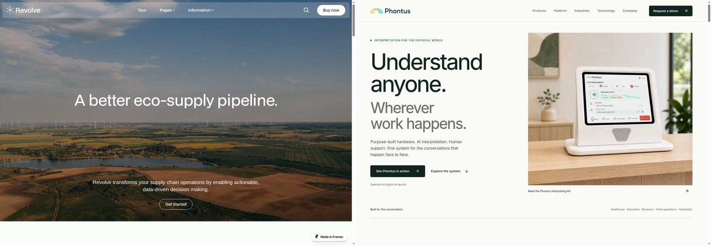
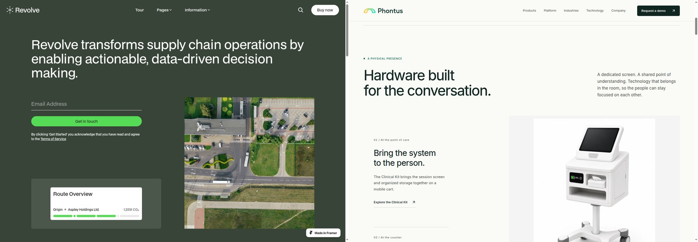

# Phontus redesign — visual and interaction QA

Date: 14 September 2026.

Reference truth: the [approved implementation plan](docs/design/phontus-implementation-plan.md), informed by browser captures of Revolve Landing 1 and Feature 3. This is an original Phontus redesign, not a pixel-for-pixel recreation. The light hardware hero, Inter typography, Phontus color palette, product imagery and five workplace stories are intentional adaptations.

## Latest update: supplied photography

The new `public/images/New Pictures/` upload was inspected as eight portrait/landscape pairs. All eight scenes are now used. Originals remain intact; 16 WebP derivatives total 1,595,094 bytes. The existing field-operations photograph remains because the upload has no field-operations replacement. The actual session-interface screenshot remains in the technology explanation.

The hero uses the new portrait kit image. Landscape workplace scenes retain their complete supplied framing; at 760px and below, `picture` sources switch to the supplied portraits. Education now gets a wider image column. Product family images and the Clinical Kit panel no longer apply padding intended for standalone renders. The hardware viewer now selects **At the doorway / In the exam room**, matching the supplied scenes rather than presenting them as camera angles.

Reviewed browser screenshots: [desktop hero](docs/design/new-photography-evidence/hero-1440.jpg), [mobile hero](docs/design/new-photography-evidence/hero-390.jpg), [hardware](docs/design/new-photography-evidence/hardware-1440.jpg), [mobile healthcare](docs/design/new-photography-evidence/healthcare-390.jpg), [education](docs/design/new-photography-evidence/education-1440.jpg), [mobile hospitality](docs/design/new-photography-evidence/hospitality-390.jpg), [tablet product family](docs/design/new-photography-evidence/family-768.jpg), [product detail](docs/design/new-photography-evidence/product-clinical-1440.jpg), and [company page](docs/design/new-photography-evidence/about-1440.jpg).

Validation: lint, typecheck and production build passed. Homepage images were checked at 1440, 768 and 390px, with additional overflow checks at 1920, 1280 and 360px. Seven secondary page/product variants were checked at 1440 and 390px: all image sources loaded, with the expected portrait/landscape selection and no page overflow. Both hardware settings were exercised at desktop and mobile widths. No browser runtime exceptions were recorded. [Latest browser results](docs/design/new-photography-evidence/checks.json).

The report below preserves the original redesign review; its imagery and front/side/rear viewer evidence predate this update.

## Evidence and comparison

Source captures: `docs/design/revolve-evidence/`. Implementation captures: `docs/design/implementation-evidence/`. Browser: Chromium 140, production Next.js build at `http://localhost:3001`.

Both desktop source images and implementation images are 1440 × 1000 pixels at a 1440 × 1000 CSS viewport, device scale factor 1. They were placed side by side, then reduced together for the comparison images. Mobile uses 390 × 844 CSS pixels at scale factor 1. Additional widths: 1920, 1280, 768 and 360.

These compare composition and visual hierarchy, not identical content or scroll coordinates. Hardware is a later homepage section in Phontus; it is compared to Feature 3’s opening composition. Full-size hero, tablet, product, menu and form screenshots were also opened to inspect text, focus states and image crops at readable resolution.

## Findings and corrections

1. **[P2, resolved] Tablet composition and overflow.** At 768px, the initial two-column industry sections squeezed copy and caused horizontal overflow. The hero crop cut into the device. Content now stacks below 960px, with a dedicated tablet hero and two-product layout. [Initial tablet](docs/design/implementation-evidence/home-768.jpg), [revised tablet](docs/design/implementation-evidence/final-home-768.jpg), [system rows](docs/design/implementation-evidence/final-system-768.jpg), [product family](docs/design/implementation-evidence/final-kits-768.jpg).
2. **[P1, resolved] Product tabs did not update reliably.** Router replacement could duplicate the fragment and leave the selected panel unchanged. Native history now updates the tab query and fragment without a route transition; ArrowLeft/ArrowRight and Home/End retain focus and update the panel. All relevant browser assertions passed after the fix.
3. **[P2, resolved] Industry detail image crops.** Portrait crops cut into participants at the edges of supplied images. Detail heroes now preserve the original 4:3 composition. [Revised healthcare hero](docs/design/implementation-evidence/final-healthcare-1440.jpg).
4. **[P2, resolved] Photo frames did not fill their columns.** An aspect ratio combined with an explicit parent height allowed the frame to derive its width from height. An explicit 100% frame width restores the intended wide compositions and keeps the adjacent copy in its grid. [Final frame-width checks](docs/design/implementation-evidence/photo-frame-checks.json) confirm all 15 checked photo frames fill their parent, with no page overflow. [Revised workplace compositions](docs/design/implementation-evidence/workplaces-and-platform.jpg) show the result.
5. **Preview environment, resolved.** An initial interaction run overlapped development rebuilds and was not accepted as functional verification. The final suite ran against a stable, freshly started production build. No application runtime exception was observed in that suite.

## Required visual surfaces

- **Typography:** Inter remains the Phontus font. Display weights are reduced to 450; hierarchy comes from scale, spacing and line breaks. Body copy remains readable and the small labels are subordinate. Final desktop, tablet and mobile screenshots were inspected for wrapping and truncation.
- **Spacing and rhythm:** The kit leads the hero. Hardware views, ruled system rows, a session explanation and differently composed workplace scenes give the page distinct sections. Product stages retain whole-device views; the Clinical Kit’s wheels remain visible in those stages. Controls use modest radii and photos have nearly square corners.
- **Color:** A predominantly light neutral canvas uses dark green ink and restrained green accents. One dark enterprise section and a pale green closing CTA provide contrast. Focus is visibly outlined; error and success messages use text as well as visual treatment.
- **Images:** Existing supplied photography and product assets are used. Clinical front/side/rear views and the session reference were converted to WebP. No generic stock images, invented device drawings or fake admin-dashboard screenshots were introduced. Original asset resolution limits enlargement quality; finer interface text in scene photography is not treated as readable UI.
- **Content:** The site describes one physical interpretation system. Spanish–English launch scope remains explicit, terminology is marked in development, and the optional operational-metrics component renders nothing without publication-approved, sourced data. Existing legal draft notices remain visible.

## Functional verification

[Browser assertion results](docs/design/implementation-evidence/checks.json): **19/19 passed**.

- Mobile menu opens; initial focus, forward/reverse focus containment, Escape and focus restoration work. Background content is restored after close.
- Hardware view selection changes the supplied image and pressed state.
- FAQ answers open and close.
- Existing Clinical Kit query links select the correct panel. Keyboard arrows and Home/End change product selection correctly.
- The Platform navigation destination exists on the product page.
- Invalid demo submissions focus the first field and associate errors with inputs.
- Mocked delivery success and failure render the correct message. Exactly two delivery requests were intercepted; no real email was sent.
- Reduced-motion mode leaves content visible without reveal transitions.

The only browser error captured in the final interaction suite was the deliberately mocked HTTP 503 used to verify delivery failure. No JavaScript exceptions were recorded. An actual invalid POST to `/api/contact` returned HTTP 400 before reaching delivery.

[Route checks](docs/design/implementation-evidence/routes.json) cover product views, platform, all industry routes, technology, company, security, contact and legal pages at desktop and mobile sizes. Canonicals point to `https://www.phontus.live`.

## Responsive and performance observations

[Viewport results](docs/design/implementation-evidence/final-responsive.json): no horizontal overflow at 1920, 1440, 1280, 768, 390 or 360px. The full Interpreting Kit is recognizable in the first screen, including the narrowest check. Larger screens retain whitespace; mobile scenes and system explanations stack.

A local, unthrottled, warm-cache production check observed LCP of 100–200ms and no layout shifts during the initial observation window across those viewports. These are local diagnostics, **not field Core Web Vitals or mobile-network performance claims**. INP was not measured. Images have reserved dimensions and responsive sources, with the hero prioritized and supporting images lazy-loaded.

## Build checks and limits

- `npm run lint` — passed, no warnings.
- `npm run typecheck` — passed.
- `npm run build` — passed; 19 static outputs generated, with the contact API remaining dynamic.
- `git diff --check` — passed.

Live email-provider delivery was intentionally not exercised. Full assistive-technology certification, real-user performance and deployment configuration remain outside this local QA pass. Higher-resolution standalone tabletop renders and a genuine admin-console screenshot are useful future assets; the implemented compositions do not depend on them.

final result: passed
