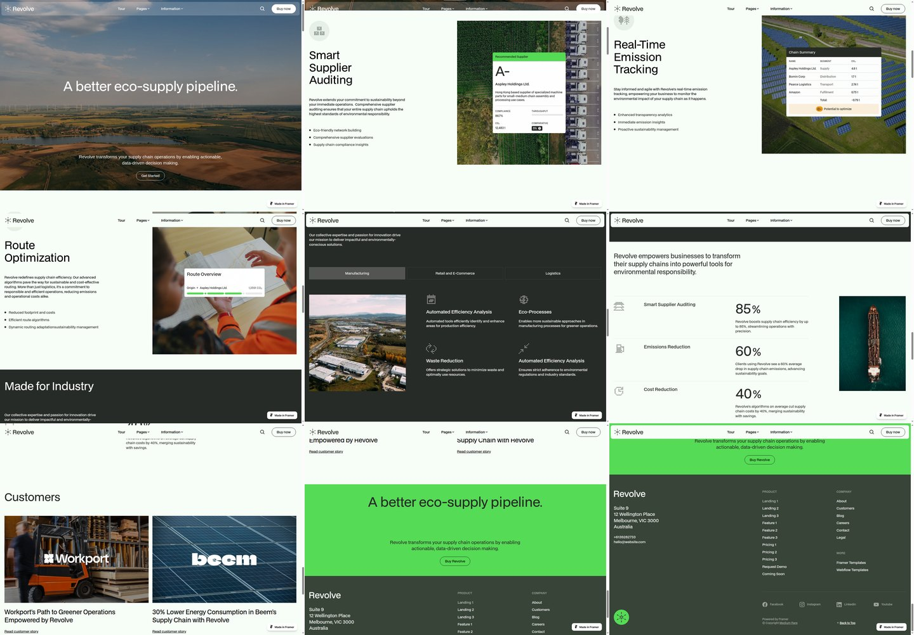
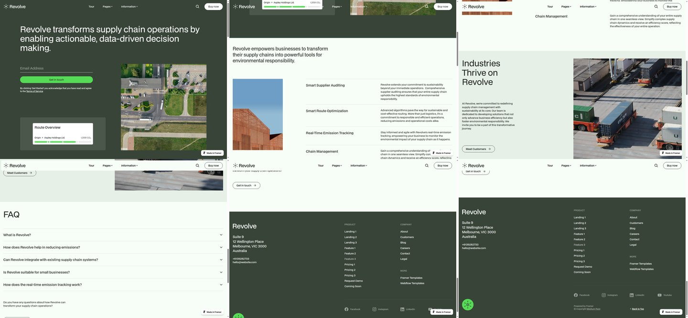
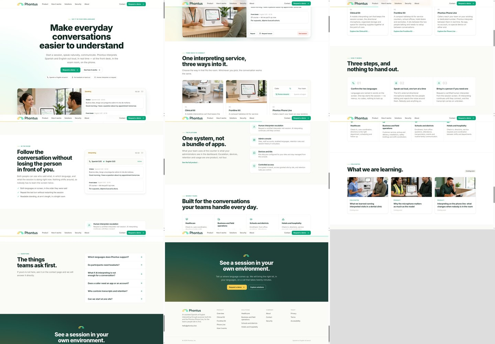
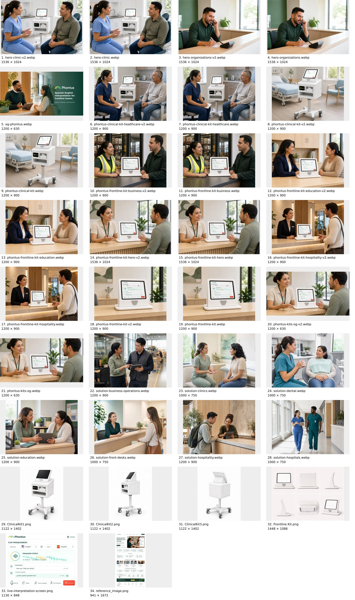

# Phontus redesign: browser findings and implementation plan

Prepared 14 September 2026 before implementation. Executed in the subsequent redesign pass; see [visual and interaction QA](../../design-qa.md).

The design direction is a physical interpretation system presented with large product imagery, lighter editorial typography, deliberate whitespace, and distinct compositions. The homepage establishes hardware, explains the connected system, shows it in workplaces, then introduces administration.

## 1. Reference inspection and evidence

Inspected the actual rendered pages in Chromium at 1440 × 1000 and 390 × 844, scrolling through both pages. Opened Landing 1's Logistics tab and mobile menu, and Feature 3's first FAQ. Screenshots below were captured during this inspection, then opened and reviewed. Overview sheets read left to right, top to bottom; captures overlap vertically.

### Landing 1

Source: [live Landing 1](https://revolve-template.framer.website/landing-1).

A full-width landscape hero uses centered, regular-weight type and a low-positioned CTA. Three consecutive feature sections place copy left and square photography right, with one UI overlay per photo. A dark industry section introduces tabs; selecting Logistics changes the image and feature text. Thinly divided metrics, paired customer stories, a bright CTA, and dark footer change the pace. Navigation stays visible and becomes light over the pale body.

At 1440px, the inspected hero heading is 61px with 67.1px line height; feature headings are 51px/58.65px, using BDO Grotesk Regular. The refinement comes from weight, proportion and space, not extreme font size alone. Mobile uses a short image hero, stacked features, vertical industry choices and a full-height menu.

**Phontus application:** use photographic scale and changes of pace. The brief calls for more varied compositions than the reference's repeated feature pairs. Keep the product visible instead of covering it with dashboard panels.

[Full-size hero](revolve-evidence/landing-1-desktop-00.jpg) · [Mobile sequence](revolve-evidence/landing-1-mobile-sheet.jpg) · [Logistics selected](revolve-evidence/landing-1-industries-logistics.jpg) · [Mobile menu](revolve-evidence/landing-1-mobile-menu.jpg)

### Feature 3

Source: [live Feature 3](https://revolve-template.framer.website/feature-3).

A dark olive opening places a wide, left-aligned statement above an email form, a large square image on the right, and a smaller inset low on the left. The next pale section combines a narrow portrait image with four ruled information rows. A tinted industry section returns to narrow copy beside a large square photograph. A full-width FAQ and dark footer finish the page. The first FAQ opens inline and pushes following rows down.

The opening headline measures 51px/58.65px at 1440px. Mobile stacks the opening, removes the secondary inset, and places the four information rows before the portrait image. This is useful evidence of deliberate reordering. There is no hardware rotation sequence on this reference; a Phontus product view change would be a new design choice.

**Phontus application:** adapt the offset composition for hardware details and the four ruled rows for the connected system. Use a light canvas for the hardware opening, consistent with the brief.

[Full-size opening](revolve-evidence/feature-3-hero.jpg) · [Mobile sequence](revolve-evidence/feature-3-mobile-sheet.jpg) · [FAQ expanded](revolve-evidence/feature-3-faq-open.jpg)

### Inspection steps and health

| Step | Surface | Finding |
| --- | --- | --- |
| 1 | Landing 1 desktop, top to footer | Loaded; clear visual hierarchy and substantial photography. |
| 2 | Landing 1 Logistics tab | Worked; image, selection treatment and feature content changed. |
| 3 | Landing 1 mobile and menu | Loaded and opened; features stack and navigation becomes a full-height panel. |
| 4 | Feature 3 desktop, top to footer | Loaded; asymmetry and ruled rows offer useful system-story structures. |
| 5 | Feature 3 FAQ | Worked; inline answer expanded visibly. |
| 6 | Feature 3 mobile | Loaded; secondary inset omitted and content reordered. |
| 7 | Phontus marketing desktop and mobile | Loaded; hardware appears too late and repeated cards dominate the middle. |

Evidence limits: screenshots and basic interactions establish composition and visible behavior, not full accessibility or performance compliance. No forms were submitted. Exact animation easing/durations, reduced-motion behavior, and comprehensive keyboard support were not verified on Revolve. Small copy over photos and the placeholder-only email field deserve separate contrast/label checks; do not inherit those patterns automatically.

## 2. Existing Phontus site and technical foundation

[Production marketing website](https://www.phontus.live/) matches the broad structure in this repository. The bare domain, `https://phontus.live`, currently opens the product login and links to the www marketing domain. Correct the marketing canonical fallback in `lib/config.ts` during implementation; keep the application and marketing destinations explicit.

On desktop the kit begins near the bottom of the first viewport; on mobile it is almost entirely below the fold. A simulated transcript shares the hero, followed by equal product cards, step cards, another simulated session, feature cards, industry tiles, and coming-soon articles. Rebuild that sequence around the hardware and provided scenes.

[Desktop hero](revolve-evidence/marketing-desktop-00.jpg) · [Mobile hero](revolve-evidence/marketing-mobile-top.jpg)

Preserve and adapt:

- Next.js App Router, TypeScript, static solution generation, existing route URLs and redirects.
- Contact form schema, server validation, delivery adapter, and honest delivery-error fallback. Improve field/error associations and input autocomplete; test with mocked delivery, without sending email.
- Metadata helpers, sitemap, robots, structured data and existing brand SVGs, with positioning and canonical updates.
- `next/image` and AVIF/WebP configuration; extend `PhotoFrame` with composition-specific sizing, focal points and aspect ratios. Its current universal `50vw` desktop sizing will be wrong for full-width scenes.
- FAQ expansion logic and the product explorer's query-string links. Improve keyboard tab behavior and mobile menu focus containment during the redesign.
- IntersectionObserver reveals, revised so content remains available with reduced motion and if enhancement fails.

Replace the homepage section structure, heavy 800-weight display treatment, repeated card surfaces, gradient washes, scroll-progress decoration and prominent mock UI. Retain useful product facts and the Phone Line detail route, but give the two hardware kits priority. Maintain old `?tab=frontline` URLs while displaying the brief's “Phontus Interpreting Kit” name.

## 3. Asset selection

Reviewed all 34 raster files found under `public/images`, `references`, and `public/reference`, including variants, product views, supplied session UI and the older website reference. Logos are available separately as SVGs.

[Dimensions and file sizes](revolve-evidence/asset-inventory.json)

| Composition | Preferred supplied asset | Treatment |
| --- | --- | --- |
| Main Interpreting Kit hero | `public/images/phontus-frontline-kit-v2.webp` | Large device-focused image; preserve entire screen, base and recognizable silhouette. Light adjacent canvas. |
| Hardware detail | `references/Frontline Kit.png` | Six-view source sheet; extract individual views only at a defensible display size. It is not six separate high-resolution renders. |
| Clinical product presentation | `references/ClinicalKit1.png`, `ClinicalKit2.png`, `ClinicalKit3.png` | Clean front, side and rear views; contain the full cart, including wheels. |
| Healthcare environment | `public/images/hero-clinic-v2.webp` | Wide human scene; keep the cart visible between participants. |
| Schools | `public/images/phontus-frontline-kit-education-v2.webp` | 4:3 composition preserving faces and central device. |
| Field operations | `public/images/phontus-frontline-kit-business-v2.webp` | Warehouse setting with high-visibility clothing and visible kit. |
| Hospitality | `public/images/phontus-frontline-kit-hospitality-v2.webp` | Generous warm reception scene. |
| Business service counter | `public/images/phontus-frontline-kit-hero-v2.webp` | Use for customer-facing business conversations; do not describe it as an executive office scene. |
| Session UI | `references/live-interpretation-screen.png` | Supplied reference, used once in the conversation explanation; not proof of current live functionality. |

The `solution-*` imagery often lacks recognizable Phontus hardware; prefer the kit-specific scenes. The source sheet limits how large a clean tabletop angle can appear. The available standalone tabletop image is sufficient for a strong first implementation. No supplied admin-dashboard screenshot was found; `ConsoleMock` is a coded illustration. Do not present it as a real console screenshot. A distinct office scene would be useful later but does not block the plan.

## 4. Proposed design tokens and responsive grid

These are Phontus starting values, not measurements copied from Revolve.

| Token | Starting specification |
| --- | --- |
| Canvas | White `#FFFFFF`, warm neutral `#FAFAF7`, quiet section tint `#F4F4F0` |
| Text | Existing dark ink `#10251F`; secondary `#4E4E49` |
| Accent | Existing green `#0B8465` for links/controls; bright green and yellow reserved for small brand details |
| Dark section | `#10251F`, used once for enterprise operations or the closing CTA |
| Typography | Existing Inter, display weights 450–550; hero 80–104px desktop / 42–52px mobile; section titles 48–64px / 32–40px; body 18–20px / 16–18px |
| Grid | 12 columns desktop, 8 tablet, 4 mobile; 24–32px desktop gaps, 16px mobile |
| Width and margins | Content maximum around 1440px; fluid 40–72px desktop margins, 24px tablet, 20px mobile; selected imagery full-bleed |
| Vertical spacing | 112–160px major desktop sections; 64–88px mobile; smaller gaps inside compositions |
| Corners and rules | Photos 0–4px; controls 6–8px; 1px neutral rules; avoid enclosing every section in a surface |

Use intentional line breaks that adapt to width, with body text generally limited to 45–65 characters per line. Crop focal points belong to individual assets. Mobile content order must also be correct in the DOM and for keyboard reading.

## 5. Homepage implementation sequence

1. **Hardware-led hero.** Short statement, “Understand anyone. Wherever work happens.” as a candidate direction; supporting text explicitly describes a physical interpretation system. Compose copy across about five columns and the tabletop kit across seven, with the kit visible within the initial desktop and mobile viewport. Use one primary demo CTA and a quieter system anchor. Keep the documented Spanish–English launch scope close enough that the aspirational headline does not imply universal current coverage.
2. **Hardware details.** Apply Feature 3's wide headline and offset visual relationship on a light surface. Show a large hardware view and one smaller physical detail, with concise labels. Use a view selector if useful; avoid pretending flat images provide true 3D rotation.
3. **One system.** Adapt Feature 3's ruled rows: hardware, AI interpretation, human support, administration. A shared product visual and one connected narrative establish the relationship. Do not package them as four competing products.
4. **AI and human assistance.** Explain the ordinary conversation path and the option to request a person, with a small, accessible diagram and supplied session image. Human escalation is user-requested in current content; do not invent automatic confidence scoring or an automatic escalation mechanism.
5. **Workplace sequence.** Introduce the idea that the environment changes while the system stays consistent. Healthcare gets a wide scene; education a smaller offset image; field operations a stronger near-full-width moment; business a compact counter composition; hospitality a warm closing image. Give each one a short use-case statement and route link. Keep all five visible in the narrative rather than hiding the core story behind tabs.
6. **Product family.** Present the Interpreting Kit and Clinical Kit at different physical scales, with clean side-by-side desktop stages and stacked mobile presentations. Show the entire cart. Keep specs short; Phone Line remains a secondary capability in product detail.
7. **Platform.** Introduce managing sites, devices, staff, sessions and usage after the physical system. Use a concise operational index until a genuine console screenshot is available; do not fabricate charts or activity. Connect each capability back to running the same kit across sites.
8. **Terminology.** Describe organization and domain terminology as planned, matching the brief's future status. Short example terms can illustrate the concept without implying measured accuracy improvements or present availability.
9. **Enterprise operations and evidence.** Use a restrained contrast section with access, session handling and deployment themes already described in the project. Keep stronger claims qualified to their source status. Build an optional evidence/metrics data model with source, date and approval fields; render nothing when verified data is absent.
10. **Questions and closing CTA.** Use a short FAQ with thin dividers and a final “Put Phontus where conversations happen” statement. Route the working CTA to the existing demo form. Remove coming-soon article filler and unverified testimonials from the rendered homepage.

## 6. Navigation, routes and content integrity

Proposed navigation: Products, Platform, Industries, Technology, Company, with Request a Demo as the primary action. Initially map these to the existing product, solutions, how-it-works and about routes, and a platform anchor within product. Recompose the current pages after the homepage establishes the visual system. Preserve existing inbound URLs, including combined business/field operations; separate those stories visibly without requiring redundant routes.

Content rules for implementation:

- The brief authorizes broader system positioning, but current repository copy states Spanish–English at launch. Preserve that availability limit until product information supersedes it.
- Use “Interpreting Kit” consistently in visible content while retaining compatible legacy links.
- Describe human interpreter support without adding guaranteed connection times, provider certifications or commercial entitlements. Existing marketing assertions do not prove service implementation.
- Terminology is planned. Do not silently turn it into a launched feature.
- Security copy exists in `app/security/page.tsx`, but this marketing repo cannot independently verify the service. Do not add compliance certifications, specific cryptography or uptime. Preserve legal draft/review status where it exists.
- Hidden testimonials, transcript timestamps and illustration numbers are not operational proof. Publish no metrics derived from them.

## 7. Motion, delivery and acceptance

Use opacity and small translate reveals with approximately 400–650ms durations; hover transitions around 150–220ms. These are proposed values. Keep product view changes optional and controllable. Any parallax should be slight, desktop-only and removable without changing content access. Respect reduced motion, keep navigation immediate, and reserve dimensions before images load.

Implementation order: first update tokens and image primitives; then the hero, hardware and system compositions; then workplace photography and the remaining narrative; then navigation and existing detail pages. Update metadata and contact/accessibility details alongside the final content pass. Keep dependencies minimal and retain server-rendered content wherever practical.

Acceptance checks:

- Inspect actual rendered pages at 1920, 1440, 1280, 768 and 390px, plus a 360px overflow check. Revisit image focal points at every size.
- The hardware is recognizable in the first viewport; no overlays obscure the screen or silhouette. The cart is never accidentally cropped at its wheels.
- Consecutive sections differ in image scale, alignment or pacing. All five settings read as uses of one product.
- Test menu open/close, keyboard focus and Escape, product deep links, FAQ, anchor destinations, demo validation, and mocked success/failure states. No accidental real email submission.
- Check semantic headings, focus visibility, contrast, descriptive alt text, field/error associations, reduced motion, zoom and horizontal overflow.
- Run lint, typecheck and production build. Inspect browser errors and image network behavior. Measure performance locally; report measured results rather than promising Core Web Vitals scores.
- Compare the finished homepage with the reference evidence and brief for hierarchy, whitespace and rhythm, while checking that the brand, hardware and story remain distinctly Phontus.

Implementation completed: the homepage, shared visual system, product and industry presentation, technology and company pages, navigation, contact accessibility and metadata were updated. The QA report records the final browser evidence and checks.
